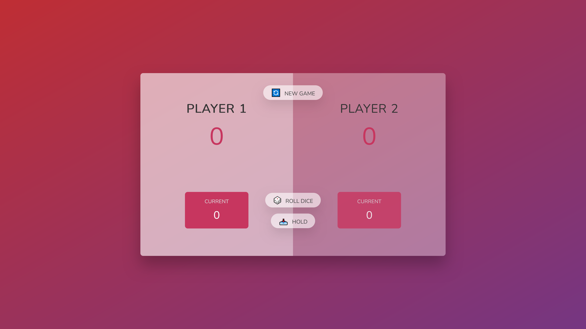
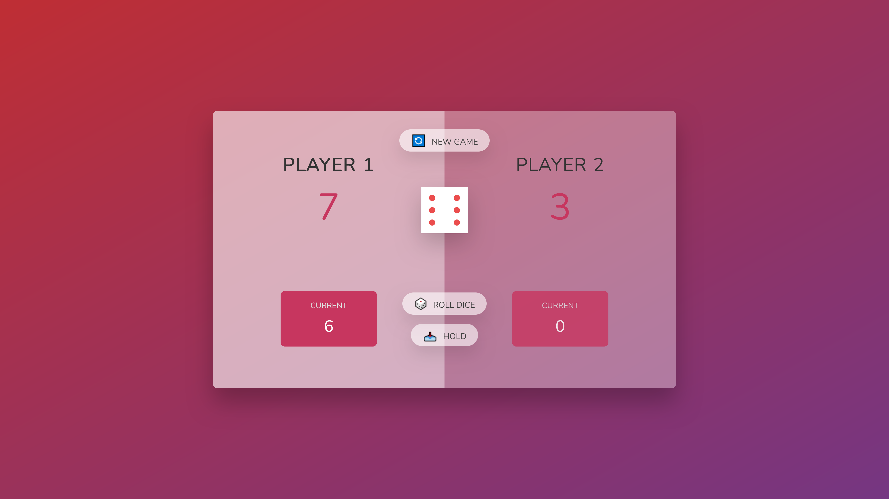
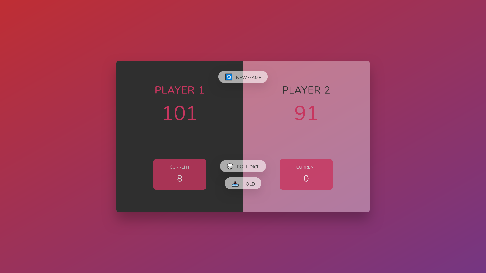

# Pig Dice Game

This project is a simple dice game called "Pig" developed by Jonas Schmedtmann. The objective of the game is to be the first player to reach 100 points.

## Game Rules

1. The game has 2 players, playing in rounds.
2. In each turn, a player rolls a dice as many times as they wish. Each result gets added to their round score.
3. If the player rolls a 1, all their round score gets lost. After that, it's the next player's turn.
4. The player can choose to 'Hold', which means that their round score gets added to their global score. After that, it's the next player's turn.
5. The first player to reach 100 points on global score wins the game.

## Features

- Two-player gameplay
- Dynamic score tracking
- Interactive user interface

## Screenshots

### Game Start

### Player Rolling Dice

### Winning Screen

## How to Play

1. Open the game in your browser.
2. Click on 'New Game' to start a new game.
3. Player 1 starts the game by clicking on 'Roll Dice'.
4. The player continues to roll the dice until they decide to 'Hold' or roll a 1.
5. The turn switches to the next player.
6. The first player to reach 100 points wins the game.
